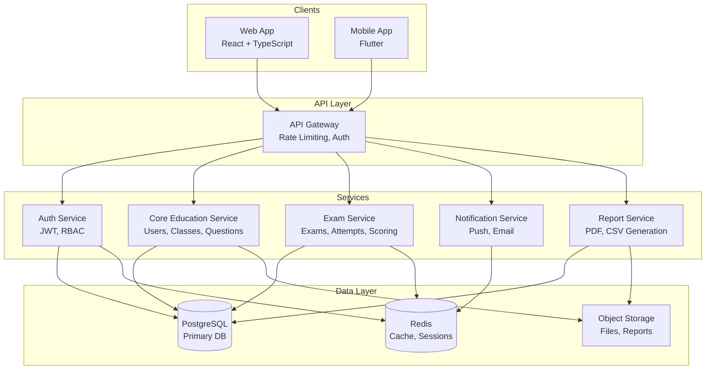
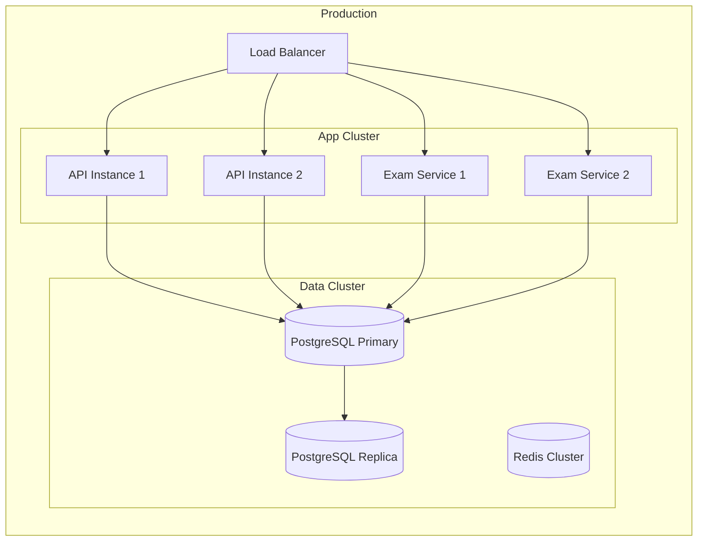
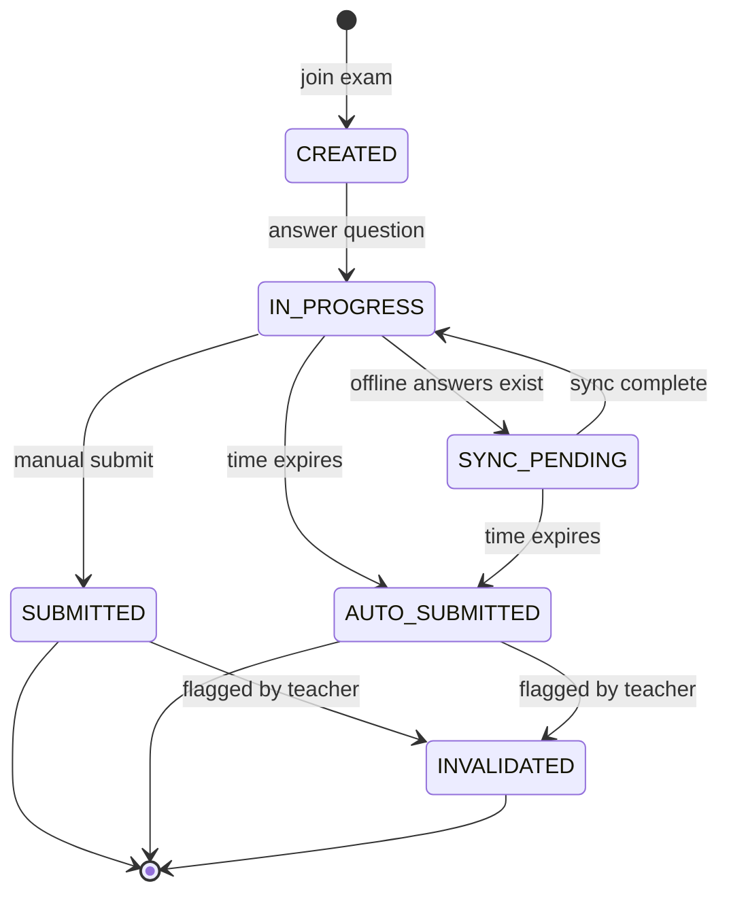

# Design Document: Online Exam Platform

## Overview

Nền tảng ôn thi - thi thử - quản lý học tập trực tuyến được thiết kế theo kiến trúc microservices với các service tách biệt cho Authentication, Core Education, Exam và AI. Hệ thống hỗ trợ Web (React + TypeScript) và Mobile (Flutter) với offline-first approach cho thi cử.

### Key Design Decisions

1. **Microservices Architecture**: Tách Exam Service riêng để đảm bảo khả năng chịu tải cao và độc lập scaling
2. **Offline-First Mobile**: Sử dụng local storage với sync mechanism để đảm bảo thi không bị gián đoạn
3. **Server-Authoritative Time**: Mọi tính toán thời gian dựa trên server time để chống gian lận
4. **Event-Driven State Machine**: Exam và Attempt lifecycle được quản lý qua state machine với audit logging

## Architecture

### System Architecture Diagram



### Deployment Architecture



## Components and Interfaces

### 1. Auth Service

**Responsibilities:**
- JWT token issuance and validation
- Refresh token management
- RBAC enforcement
- Session management

**Interface:**
```typescript
interface AuthService {
  login(credentials: LoginRequest): Promise<AuthTokens>;
  refresh(refreshToken: string): Promise<AuthTokens>;
  logout(userId: string): Promise<void>;
  validateToken(token: string): Promise<TokenPayload>;
  checkPermission(userId: string, resource: string, action: string): Promise<boolean>;
}

interface LoginRequest {
  username: string;
  password: string;
}

interface AuthTokens {
  accessToken: string;
  refreshToken: string;
  expiresIn: number;
}

interface TokenPayload {
  userId: string;
  role: UserRole;
  schoolId?: string;
  exp: number;
}
```

### 2. Core Education Service

**Responsibilities:**
- User management (CRUD, import)
- Class management
- Question bank management
- Parent-Student linking

**Interface:**
```typescript
interface UserService {
  createUser(data: CreateUserRequest): Promise<User>;
  importUsers(csvData: Buffer, schoolId: string): Promise<ImportResult>;
  updateUser(userId: string, data: UpdateUserRequest): Promise<User>;
  deactivateUser(userId: string): Promise<void>;
  linkParentToStudent(parentId: string, studentId: string): Promise<void>;
}

interface ClassService {
  createClass(data: CreateClassRequest): Promise<Class>;
  addStudents(classId: string, studentIds: string[]): Promise<void>;
  removeStudent(classId: string, studentId: string): Promise<void>;
  getClassDetails(classId: string): Promise<ClassDetails>;
}

interface QuestionService {
  createQuestion(data: CreateQuestionRequest): Promise<Question>;
  updateQuestion(questionId: string, data: UpdateQuestionRequest): Promise<Question>;
  searchQuestions(criteria: QuestionSearchCriteria): Promise<PaginatedResult<Question>>;
  softDeleteQuestion(questionId: string): Promise<void>;
}
```

### 3. Exam Service

**Responsibilities:**
- Exam lifecycle management
- Attempt management
- Question set generation
- Auto-grading
- Score management

**Interface:**
```typescript
interface ExamService {
  createExam(data: CreateExamRequest): Promise<Exam>;
  updateExamState(examId: string, newState: ExamState): Promise<Exam>;
  openExam(examId: string, password: string): Promise<void>;
  getExamForStudent(examId: string, studentId: string): Promise<ExamView>;
}

interface AttemptService {
  joinExam(examId: string, studentId: string, password: string): Promise<ExamAttempt>;
  saveAnswer(attemptId: string, questionId: string, answer: Answer): Promise<void>;
  submitAttempt(attemptId: string): Promise<AttemptResult>;
  autoSubmitExpired(attemptId: string): Promise<AttemptResult>;
  syncOfflineAnswers(attemptId: string, answers: OfflineAnswerBatch): Promise<SyncResult>;
}

interface ScoringService {
  calculateScore(attemptId: string): Promise<number>;
  requestScoreModification(attemptId: string, newScore: number, reason: string): Promise<ScoreModificationRequest>;
  approveScoreModification(requestId: string, approverId: string): Promise<void>;
  publishResults(examId: string): Promise<void>;
}
```

### 4. Notification Service

**Responsibilities:**
- Push notifications (mobile)
- Email notifications
- In-app notifications
- Retry logic

**Interface:**
```typescript
interface NotificationService {
  sendNotification(notification: NotificationRequest): Promise<void>;
  scheduleNotification(notification: NotificationRequest, scheduledTime: Date): Promise<string>;
  cancelScheduledNotification(notificationId: string): Promise<void>;
  getNotificationHistory(userId: string): Promise<Notification[]>;
}

interface NotificationRequest {
  recipientIds: string[];
  type: NotificationType;
  title: string;
  body: string;
  data?: Record<string, unknown>;
  channels: NotificationChannel[];
}
```

### 5. Report Service

**Responsibilities:**
- Report generation (PDF, CSV)
- Async processing for large datasets
- Export with audit metadata

**Interface:**
```typescript
interface ReportService {
  generateClassReport(classId: string, examId: string, format: ReportFormat): Promise<ReportJob>;
  generateSchoolReport(schoolId: string, criteria: ReportCriteria): Promise<ReportJob>;
  getReportStatus(jobId: string): Promise<ReportJobStatus>;
  downloadReport(jobId: string): Promise<Buffer>;
}
```

## Data Models

### Entity Relationship Diagram

```mermaid
erDiagram
    users ||--o{ students : "has profile"
    users ||--o{ parents : "has profile"
    users ||--o{ teachers : "has profile"
    parents ||--o{ parent_student_links : "links to"
    students ||--o{ parent_student_links : "linked by"
    students ||--o{ class_enrollments : "enrolled in"
    classes ||--o{ class_enrollments : "has"
    teachers ||--o{ classes : "owns"
    teachers ||--o{ questions : "creates"
    classes ||--o{ exams : "has"
    exams ||--o{ exam_attempts : "has"
    students ||--o{ exam_attempts : "takes"
    exam_attempts ||--o{ attempt_answers : "contains"
    questions ||--o{ attempt_answers : "answered in"
    exam_attempts ||--o{ uploaded_files : "has"
    
    users {
        uuid id PK
        string username UK
        string password_hash
        enum role
        enum status
        timestamp created_at
        timestamp updated_at
    }
    
    students {
        uuid id PK
        uuid user_id FK
        string full_name
        date dob
        uuid school_id
    }
    
    parents {
        uuid id PK
        uuid user_id FK
        string full_name
        string phone
    }
    
    parent_student_links {
        uuid id PK
        uuid parent_id FK
        uuid student_id FK
        timestamp linked_at
    }
    
    teachers {
        uuid id PK
        uuid user_id FK
        string full_name
        uuid school_id
    }
    
    classes {
        uuid id PK
        string name
        int grade
        string school_year
        uuid teacher_id FK
        uuid school_id
    }
    
    class_enrollments {
        uuid id PK
        uuid class_id FK
        uuid student_id FK
        enum status
        timestamp enrolled_at
    }
    
    questions {
        uuid id PK
        uuid teacher_id FK
        string subject
        string chapter
        enum level
        enum type
        jsonb content_json
        jsonb answers_json
        string correct_answer
        int version
        boolean is_deleted
        timestamp created_at
    }
    
    exams {
        uuid id PK
        uuid class_id FK
        uuid teacher_id FK
        string title
        enum state
        timestamp start_time
        int duration_minutes
        string password_open
        string password_view
        jsonb config_json
        int max_attempts
        enum scoring_method
        timestamp created_at
    }
    
    exam_attempts {
        uuid id PK
        uuid exam_id FK
        uuid student_id FK
        jsonb question_set_json
        enum state
        timestamp started_at
        timestamp submitted_at
        decimal score
        int attempt_number
        jsonb activity_log
    }
    
    attempt_answers {
        uuid id PK
        uuid attempt_id FK
        uuid question_id FK
        jsonb answer_json
        boolean is_correct
        timestamp answered_at
        timestamp synced_at
    }
    
    uploaded_files {
        uuid id PK
        uuid attempt_id FK
        uuid question_id FK
        string file_path
        string file_type
        int file_size
        timestamp uploaded_at
    }
    
    audit_logs {
        uuid id PK
        uuid actor_id FK
        string action
        string resource_type
        uuid resource_id
        jsonb data_json
        string ip_address
        timestamp created_at
    }
    
    score_modification_requests {
        uuid id PK
        uuid attempt_id FK
        uuid requester_id FK
        decimal original_score
        decimal new_score
        string reason
        enum status
        jsonb approvals_json
        timestamp created_at
    }
    
    notifications {
        uuid id PK
        uuid recipient_id FK
        enum type
        string title
        string body
        jsonb data_json
        boolean is_read
        int retry_count
        timestamp scheduled_at
        timestamp sent_at
    }


### State Machines

#### Exam State Machine

```mermaid
stateDiagram-v2
    [*] --> DRAFT: create exam
    DRAFT --> SCHEDULED: schedule with start_time
    DRAFT --> DRAFT: edit config
    SCHEDULED --> OPEN: start_time reached
    SCHEDULED --> DRAFT: cancel schedule
    OPEN --> IN_PROGRESS: first student joins
    IN_PROGRESS --> CLOSED: all attempts done OR manual close
    CLOSED --> RESULT_PUBLISHED: publish results
    RESULT_PUBLISHED --> ARCHIVED: archive
    ARCHIVED --> [*]
```

#### Exam Attempt State Machine



### Enums and Types

```typescript
enum UserRole {
  ADMIN_SYSTEM = 'ADMIN_SYSTEM',
  ADMIN_SCHOOL = 'ADMIN_SCHOOL',
  TEACHER = 'TEACHER',
  STUDENT = 'STUDENT',
  PARENT = 'PARENT'
}

enum UserStatus {
  ACTIVE = 'ACTIVE',
  INACTIVE = 'INACTIVE',
  PENDING = 'PENDING'
}

enum ExamState {
  DRAFT = 'DRAFT',
  SCHEDULED = 'SCHEDULED',
  OPEN = 'OPEN',
  IN_PROGRESS = 'IN_PROGRESS',
  CLOSED = 'CLOSED',
  RESULT_PUBLISHED = 'RESULT_PUBLISHED',
  ARCHIVED = 'ARCHIVED'
}

enum AttemptState {
  CREATED = 'CREATED',
  IN_PROGRESS = 'IN_PROGRESS',
  SYNC_PENDING = 'SYNC_PENDING',
  SUBMITTED = 'SUBMITTED',
  AUTO_SUBMITTED = 'AUTO_SUBMITTED',
  INVALIDATED = 'INVALIDATED'
}

enum QuestionType {
  MULTIPLE_CHOICE = 'MULTIPLE_CHOICE',
  TRUE_FALSE = 'TRUE_FALSE',
  FILL_BLANK = 'FILL_BLANK',
  ESSAY = 'ESSAY'
}

enum QuestionLevel {
  EASY = 'EASY',
  MEDIUM = 'MEDIUM',
  HARD = 'HARD'
}

enum ScoringMethod {
  HIGHEST = 'HIGHEST',
  LATEST = 'LATEST',
  AVERAGE = 'AVERAGE'
}

enum NotificationType {
  EXAM_SCHEDULED = 'EXAM_SCHEDULED',
  EXAM_STARTING = 'EXAM_STARTING',
  RESULTS_PUBLISHED = 'RESULTS_PUBLISHED',
  SUSPICIOUS_ACTIVITY = 'SUSPICIOUS_ACTIVITY',
  CLASS_ENROLLED = 'CLASS_ENROLLED'
}

enum NotificationChannel {
  PUSH = 'PUSH',
  EMAIL = 'EMAIL',
  IN_APP = 'IN_APP'
}

enum ReportFormat {
  PDF = 'PDF',
  CSV = 'CSV'
}

enum ScoreModificationStatus {
  PENDING = 'PENDING',
  APPROVED = 'APPROVED',
  REJECTED = 'REJECTED'
}
```

### JSON Schema Definitions

#### config_json (Exam Configuration)

```json
{
  "questionCriteria": {
    "subject": "string",
    "chapters": ["string"],
    "levelDistribution": {
      "EASY": 5,
      "MEDIUM": 10,
      "HARD": 5
    },
    "totalQuestions": 20
  },
  "shuffleQuestions": true,
  "shuffleAnswers": true,
  "showResultImmediately": false,
  "allowReview": true,
  "passingScore": 50
}
```

#### content_json (Question Content)

```json
{
  "text": "What is 2 + 2?",
  "images": ["url1", "url2"],
  "latex": "\\frac{a}{b}"
}
```

#### answers_json (Question Answers)

```json
{
  "options": [
    {"id": "A", "text": "3"},
    {"id": "B", "text": "4"},
    {"id": "C", "text": "5"},
    {"id": "D", "text": "6"}
  ]
}
```

#### question_set_json (Generated Question Set)

```json
{
  "questions": [
    {
      "questionId": "uuid",
      "order": 1,
      "shuffledAnswerOrder": ["B", "A", "D", "C"]
    }
  ],
  "generatedAt": "2024-01-01T00:00:00Z"
}
```

## Correctness Properties

*A property is a characteristic or behavior that should hold true across all valid executions of a system-essentially, a formal statement about what the system should do. Properties serve as the bridge between human-readable specifications and machine-verifiable correctness guarantees.*

### Property 1: Authentication Token Round-Trip
*For any* valid user credentials, logging in should return valid JWT and refresh tokens, and using the refresh token should return a new valid access token.
**Validates: Requirements 1.1, 1.3**

### Property 2: Invalid Credentials Rejection
*For any* invalid credentials (wrong username or password), the login attempt should be rejected with a generic error message that does not reveal which credential is incorrect.
**Validates: Requirements 1.2**

### Property 3: Logout Invalidates Session
*For any* authenticated user, after logout, the previously issued tokens should no longer be valid for API requests.
**Validates: Requirements 1.4**

### Property 4: RBAC Enforcement
*For any* authenticated user and any API endpoint, the request should only succeed if the user's role has permission for that resource and action.
**Validates: Requirements 1.5**

### Property 5: User Creation Uniqueness
*For any* new user created by Admin_School, the generated user ID should be unique, and the password should be stored as a hash (not plaintext).
**Validates: Requirements 2.1**

### Property 6: Parent-Student Link Access
*For any* Parent linked to a Student, the Parent should have view access to that Student's data and no other Student's data.
**Validates: Requirements 2.3, 9.1**

### Property 7: User Deactivation Prevents Login
*For any* deactivated user, subsequent login attempts should fail regardless of correct credentials.
**Validates: Requirements 2.4**

### Property 8: Audit Log Completeness
*For any* data modification operation, an audit log entry should be created containing actor_id, action, data_json, and timestamp.
**Validates: Requirements 2.5, 10.1**

### Property 9: Class Ownership
*For any* class created by a Teacher, the Teacher should be associated as the owner with full management permissions.
**Validates: Requirements 3.1**

### Property 10: Student Removal Preserves History
*For any* student removed from a class, the enrollment status should be updated but all historical exam data should remain intact.
**Validates: Requirements 3.3**

### Property 11: Question Versioning
*For any* question update, a new version should be created while the original version is preserved for historical exam integrity.
**Validates: Requirements 4.3**

### Property 12: Question Soft Delete
*For any* deleted question, it should be soft-deleted (excluded from future exams) but preserved for historical references in past exams.
**Validates: Requirements 4.5**

### Property 13: Multiple Choice Validation
*For any* multiple-choice question, there must be at least 2 answer options and exactly one correct answer.
**Validates: Requirements 4.2**

### Property 14: Exam Configuration Serialization Round-Trip
*For any* exam configuration object, serializing to config_json and deserializing should produce an equivalent object with all parameters preserved.
**Validates: Requirements 5.4, 13.3, 13.4, 13.5**

### Property 15: Unique Question Set Per Student
*For any* student joining an exam, the generated Question_Set should be unique (randomized order) compared to other students in the same exam.
**Validates: Requirements 6.1, 7.1**

### Property 16: Questions Without Answers
*For any* question returned to a student during an exam, the correct answer should not be included in the response.
**Validates: Requirements 6.2**

### Property 17: Offline Sync Consistency
*For any* answers saved offline during network loss, syncing upon reconnection should preserve all answers with correct timestamps.
**Validates: Requirements 6.4, 12.3**

### Property 18: Auto-Grading Correctness
*For any* submitted exam with objective questions, the auto-grading should correctly calculate the score based on correct answers.
**Validates: Requirements 6.5, 8.1**

### Property 19: Auto-Submit on Timeout
*For any* exam attempt where duration expires, the current answers should be auto-submitted and no further modifications should be allowed.
**Validates: Requirements 6.6**

### Property 20: Concurrent Login Termination
*For any* account logged in from a second device during an exam, the first session should be terminated and the incident logged.
**Validates: Requirements 7.4**

### Property 21: Suspicious Activity Logging
*For any* suspicious activity (app switch, time manipulation, etc.), details should be recorded in Audit_Log.
**Validates: Requirements 7.3, 7.5**

### Property 22: Score Modification Workflow
*For any* score modification request, the change should only be applied after completing the 4-level approval workflow with full audit trail.
**Validates: Requirements 8.2, 8.3**

### Property 23: Results Publication Prerequisites
*For any* exam, results can only be published when either 100% of students have submitted or the exam timeout has occurred.
**Validates: Requirements 8.4**

### Property 24: Audit Log Immutability
*For any* audit log entry, modification or deletion should be prevented.
**Validates: Requirements 10.3**

### Property 25: Exam State Machine Validity
*For any* exam, state transitions should follow the defined state machine: DRAFT → SCHEDULED → OPEN → IN_PROGRESS → CLOSED → RESULT_PUBLISHED → ARCHIVED.
**Validates: Requirements 14.1, 14.3, 14.4, 14.5, 14.6, 14.7, 14.8**

### Property 26: Attempt State Machine Validity
*For any* exam attempt, state transitions should follow the defined state machine: CREATED → IN_PROGRESS → (SYNC_PENDING) → SUBMITTED/AUTO_SUBMITTED → (INVALIDATED).
**Validates: Requirements 15.1, 15.2, 15.3, 15.4, 15.5, 15.6**

### Property 27: Server-Authoritative Time
*For any* exam timing calculation, server time should be used as authoritative, and remaining time should be recalculated from server on reconnection.
**Validates: Requirements 16.1, 16.2, 16.5**

### Property 28: Attempt Limit Enforcement
*For any* exam with configured max_attempts, students should be prevented from creating new attempts after reaching the limit.
**Validates: Requirements 17.1, 17.2, 17.4**

### Property 29: Multi-Attempt Score Calculation
*For any* student with multiple attempts, the final score should be calculated based on the configured scoring method (highest, latest, or average).
**Validates: Requirements 17.3**

### Property 30: Notification Retry Logic
*For any* failed notification delivery, the system should retry up to 3 times with exponential backoff.
**Validates: Requirements 18.4**

### Property 31: File Upload Validation
*For any* file upload, the file type should be validated against allowed extensions (PDF, JPG, PNG) and size should not exceed 10MB.
**Validates: Requirements 19.1, 19.2**

### Property 32: File Access RBAC
*For any* file access request, RBAC permissions should be enforced before serving the file.
**Validates: Requirements 19.4**

### Property 33: Report RBAC Scoping
*For any* generated report, data should be limited to the authorized scope based on the requesting user's role.
**Validates: Requirements 20.4**

### Property 34: Conflict Resolution by Timestamp
*For any* sync conflict between offline and server answers, the answer with the latest timestamp should be used.
**Validates: Requirements 12.5**

### Property 35: Feature Flag Toggle
*For any* feature flag change, the feature should be enabled or disabled without requiring redeployment.
**Validates: Requirements 21.3**

## Error Handling

### Error Response Format

All API errors follow a consistent JSON structure:

```json
{
  "error": {
    "code": "ERROR_CODE",
    "message": "Human-readable message",
    "details": {},
    "timestamp": "2024-01-01T00:00:00Z",
    "requestId": "uuid"
  }
}
```

### Error Categories

| Category | HTTP Status | Error Codes |
|----------|-------------|-------------|
| Authentication | 401 | INVALID_CREDENTIALS, TOKEN_EXPIRED, TOKEN_INVALID |
| Authorization | 403 | ACCESS_DENIED, INSUFFICIENT_PERMISSIONS |
| Validation | 400 | VALIDATION_ERROR, INVALID_FORMAT, MISSING_FIELD |
| Not Found | 404 | RESOURCE_NOT_FOUND, USER_NOT_FOUND, EXAM_NOT_FOUND |
| Conflict | 409 | DUPLICATE_ENTRY, STATE_CONFLICT, CONCURRENT_MODIFICATION |
| Business Logic | 422 | EXAM_NOT_OPEN, MAX_ATTEMPTS_REACHED, EXAM_EXPIRED |
| Server Error | 500 | INTERNAL_ERROR, DATABASE_ERROR |

### Offline Error Handling (Mobile)

```dart
class OfflineErrorHandler {
  // Queue failed operations for retry
  Future<void> queueForRetry(Operation op);
  
  // Sync queued operations when online
  Future<SyncResult> syncPendingOperations();
  
  // Handle conflict resolution
  Future<void> resolveConflict(ConflictData conflict);
}
```

### Exam-Specific Error Handling

1. **Network Loss During Exam**: Continue with local storage, queue answers for sync
2. **Session Termination**: Save current state, show reconnection dialog
3. **Time Sync Failure**: Use last known server time, flag for review
4. **File Upload Failure**: Retry with exponential backoff, allow manual retry

## Testing Strategy

### Testing Framework Selection

- **Backend (Laravel)**: PHPUnit for unit tests, Pest PHP for property-based testing
- **Mobile (Flutter)**: flutter_test with dart_check for property-based testing
- **Integration**: Laravel HTTP tests, Flutter integration_test

### Unit Testing

Unit tests cover specific examples and edge cases:

1. **Auth Service**
   - Login with valid/invalid credentials
   - Token refresh flow
   - RBAC permission checks

2. **Exam Service**
   - State transitions
   - Question set generation
   - Score calculation

3. **Sync Service**
   - Conflict resolution
   - Offline queue management

### Property-Based Testing

Property-based tests verify universal properties using Pest PHP (Laravel) and dart_check (Flutter):

1. **Serialization Round-Trip**
   - Generate random exam configs, serialize/deserialize, verify equality
   - Generate random questions, serialize/deserialize, verify structure

2. **State Machine Properties**
   - Generate random sequences of events, verify valid state transitions
   - Verify invalid transitions are rejected

3. **RBAC Properties**
   - Generate random user/resource/action combinations
   - Verify permission enforcement

4. **Score Calculation**
   - Generate random answer sets, verify correct scoring
   - Verify multi-attempt score methods

### Test Annotation Format

All property-based tests must be annotated with:
```php
/**
 * Feature: online-exam-platform, Property {number}: {property_text}
 * Validates: Requirements {X.Y}
 */
```

### Test Coverage Requirements

- Minimum 80% code coverage for core business logic
- 100% coverage for security-critical paths (auth, RBAC)
- All correctness properties must have corresponding property-based tests

### Integration Testing

1. **End-to-End Exam Flow**
   - Create exam → Schedule → Open → Join → Submit → Grade → Publish

2. **Offline Sync Flow**
   - Start exam → Go offline → Answer questions → Reconnect → Verify sync

3. **Multi-Device Scenario**
   - Login device A → Login device B → Verify session termination

